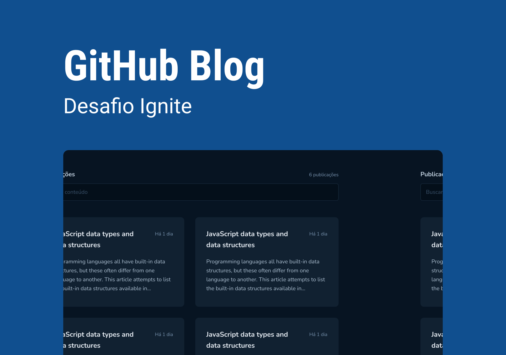

<p align="center">
    
</p>

<p align="center">
  <a href="#-tecnologias">Tecnologias</a>&nbsp;&nbsp;&nbsp;|&nbsp;&nbsp;&nbsp;
  <a href="#-layout">Layout</a>&nbsp;&nbsp;&nbsp;|&nbsp;&nbsp;&nbsp;
  <a href="#-como-executar">Como executar</a>&nbsp;&nbsp;&nbsp;|&nbsp;&nbsp;&nbsp;
  <a href="#-licença">Licença</a>
</p>

<p align="center">


</p>

<h1 align="center">
    
</h1>

<br/>

## 🧪 Tecnologias

Esse projeto foi desenvolvido com as seguintes tecnologias:

- [ReactJS](https://reactjs.org)
- [ViteJS](https://vitejs.dev)
- [TypeScript](https://www.typescriptlang.org/)
- [React Router](https://v5.reactrouter.com/web/guides/quick-start)
- [React Hook Form](https://react-hook-form.com)
- [React Query](https://react-query-v3.tanstack.com)
- [Styled Components](https://styled-components.com)

<br/>

## 🔖 Layout

Você pode visualizar o layout do projeto através do link abaixo:

- [Layout Web](https://www.figma.com/community/file/1138814951106121051)

Lembrando que você precisa ter uma conta no [Figma](http://figma.com/).

<br/>

## 🚀 Como executar

Clone o repositório

```bash
# Clone o repositório
$ git clone https://github.com/Wesley45/reactjs-github-blog-challenge.git

# Entre no repositório
$ cd reactjs-github-blog-challenge

# Instalar as dependências
$ yarn install

# Iniciar o projeto
$ yarn dev
```

O app estará disponível no seu browser pelo endereço http://localhost:5173.

<br/>

## 📝 Licença

Esse projeto está sob a licença MIT. Veja o arquivo [LICENSE](LICENSE.md) para mais detalhes.

---

<br/>

### Autor

---

<a href="https://blog.rocketseat.com.br/author/thiago/">
 
 <br />
 <sub><b>Wesley Santos</b></sub></a> <a href="https://github.com/Wesley45/" title="Wesley Santos">🚀</a>

Feito com ❤️ por Wesley Santos!

[](https://www.linkedin.com/in/wesley-santos-051383149/)
